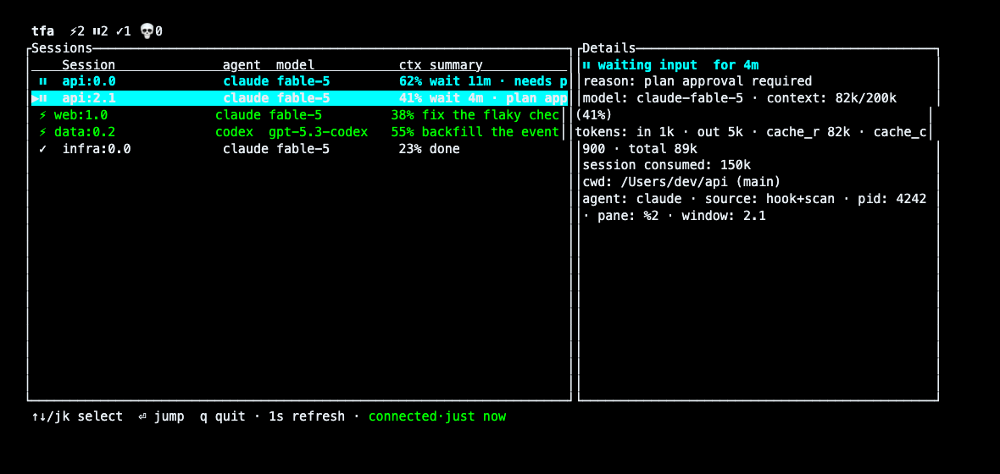

[English](README.md) | 简体中文

# tfa — tmux for agents

面向 tmux 的 AI coding agent 可观测性工具：谁在工作、谁在等你、谁已经
完成——状态栏里一眼看到；想看细节时还有一个完整的交互式仪表盘。



tfa 由一个小型 daemon + 一组 agent hooks + 一个后台 scanner 组成：
- **hooks** 在 Claude Code 生命周期事件发生的瞬间（会话开始、提交了
  prompt、等待你输入、结束、使用工具）就上报给本地 daemon；
- **后台 scanner** 直接读取 agent 的会话记录/状态（Claude Code 的
  JSONL 会话文件、Codex 的 sqlite 状态库），即使 hook 还没触发，会话
  也能出现，并为每个会话补充模型、上下文用量、token 总量等信息；
- **daemon** 把两路数据源合并成「每个 tmux pane 一份」的快照，经本地
  Unix socket 对外提供；
- `tfa status --format tmux` 把这份快照渲染成一行摘要
  （`⚡1 ⏸2 ✓1 💀0`），供 tmux `status-right` 使用；
- `tfa tui` 把同一份快照渲染成 tmux 内的完整交互式仪表盘——列表 +
  详情两栏、键盘导航，外加杀手锏功能：选中某个 agent 按 Enter 直接
  跳转到它的 pane；
- tfa 还能**主动通知你**（桌面通知、tmux 状态消息、和/或手机推送）——
  当某个 agent 开始等你输入、完成、失联或退出时；
- 并维护每个 provider 的**本地用量/burn rate 估算**（不是读取你真实
  的订阅配额——具体含义见下方 [配额](#配额quota) 一节）。

## 安装

### 前置要求

- Rust 工具链（`cargo`）——没有的话用 [rustup](https://rustup.rs) 装。
- tmux **>= 3.1**（侧栏键位需要 3.1；popup 键位需要 **>= 3.2**，
  因为用到 `display-popup`）。
- macOS，桌面通知渠道需要（`terminal-notifier` 或 `osascript`）——
  见下方 [通知](#通知m3) 一节。tfa 其余部分（daemon、hooks、scanner、
  TUI、tmux/HTTP 通知渠道）只用到跨平台的东西（Unix socket、`tmux`、
  `ps`），完整测试套件（含 tmux e2e）在 CI 的 Linux 上全绿——不过日常
  开发在 macOS 上进行，且桌面通知在 Linux 上目前会静默不生效（还没实现
  `notify-send` 渠道）。

### 1. 克隆并编译

```sh
git clone https://github.com/sbraveyoung/tmux_for_agents
cd tmux_for_agents
cargo install --path .
```

这会把 `tfa` 装到 `~/.cargo/bin`（确保这个目录在你的 `PATH` 里）。

### 2. Claude Code 集成

在 Claude Code 会话里执行：

```
/plugin marketplace add sbraveyoung/tmux_for_agents
/plugin install tfa@tfa
```

这会接好各个 hook（会话开始/结束、提交 prompt、通知、结束、工具调用
后），让它们上报给 tfa daemon。新开的 Claude Code 会话会自动生效；
已经在跑的会话需要重启（或用 `claude -c` 恢复一次）才能生效。

### 3. tmux.conf

加一段状态栏配置：

```tmux
set -g status-interval 5
set -g status-right '#(tfa status --format tmux) | %H:%M'
```

以及推荐的 `tfa tui` 键位（也可以随时用 `tfa tui --print-keybindings`
再打印一次；tfa 不会自动帮你改 `tmux.conf`）：

```tmux
# ~/.tmux.conf — recommended tfa tui keybindings
# ~/.tmux.conf — tfa tui 推荐键位
# Note: display-popup/split-window's -e does not expand tmux formats (verified on tmux 3.7b);
# 注意：display-popup/split-window 的 -e 不做 format 展开（tmux 3.7b 实测），
# you must wrap with run-shell so #{client_tty} expands to a real tty before injection.
# 必须用 run-shell 包装，让 #{client_tty} 在按键时先展开成真实 tty 再注入。
# popup (on demand; needs tmux >= 3.2): prefix+a opens it, q/Esc closes, Enter-jump auto-closes it
# popup（按需查看；需 tmux >= 3.2）：prefix+a 弹出，q/Esc 关闭，Enter 跳转后自动关闭
bind a run-shell -b "tmux display-popup -c '#{client_tty}' -t '#{pane_id}' -e TFA_CLIENT='#{client_tty}' -E -w 90% -h 80% 'tfa tui'"
# sidebar (needs tmux >= 3.1): prefix+A opens it; --stay keeps it resident after Enter jumps (the jump already happened; the original window keeps refreshing)
# 侧栏（需 tmux >= 3.1）：prefix+A 打开；--stay 让 Enter 跳转后侧栏常驻（跳转已发生，原窗口继续刷新）
bind A run-shell -b "tmux split-window -t '#{pane_id}' -h -l 40% -e TFA_CLIENT='#{client_tty}' 'tfa tui --stay'"
```

新开的 claude 会话会自动出现在状态栏和 TUI 里；已有会话在下一次
prompt 后出现，或者用 `claude -c` 重启。

### 4. 可选的 `~/.config/tfa/config.toml`

以下内容全部可选——文件缺失（或 `TFA_CONFIG_PATH` 指向不存在的路径）
就用全部默认值，绝不硬失败。`[tui]` 段控制仪表盘的语言/外观：

```toml
[tui]
lang = "auto"             # "auto"（默认，按 LANG/LC_* 探测）| "en" | "zh"
color = false              # 默认 false（黑白）；true 时启用下面的调色板
[tui.state_colors]         # 可选，只在 color = true 时生效
waiting = "magenta"        # 覆盖某个状态的颜色；完整列表见下方对应章节
```

通知与配额窗口相关设置（`[notify]`、`[quota]`）也在同一个文件里——完整
schema 见下方 [通知](#通知m3) 与 [配额](#配额quota) 两节。

## `tfa tui` — tmux 内交互仪表盘

全屏 TUI：列表 + 详情两栏，↑↓/jk 选中，Enter 直接把你带到该 agent 的
pane（只切窗口、绝不注入按键），q/Esc/Ctrl-C 退出。数据每 1s 从 daemon
快照刷新；Footer 显示「已连接·刚刚」/「已连接·Ns前」标注快照新鲜度（<2s
内收到算「刚刚」，之后显示精确秒数），daemon 断连时显示「重连中…」，UI
永不冻结。

会话列显示精确坐标 `session:window.pane`（如 `company:3.0`），同一
session 下多个 window/pane 各挂一个 agent 时也能一眼区分；坐标未知时回落
`session %pane_id`。

界面支持中英双语：启动时按 `LC_ALL`/`LC_MESSAGES`/`LANG`（取第一个非空
的）自动探测语言，也可以在 `config.toml` 里用 `[tui] lang = "en" | "zh"`
显式覆盖（见上方安装步骤 4）。

已知行为：

- **嵌套 tmux**（SSH 远端再开 tmux）下不保证跳转正确；非 tmux 环境里
  Enter 禁用并提示。
- 多个 client attach **同一** session 时，Enter 跳转会联动所有这些
  client（tmux 会话模型：一个 session 只有一个当前 window，不是 client
  私有的）——要独立观察不同 agent，请让每个 client attach 不同 session。
  这一联动还有一种不那么直观的触发方式：跳转目标恰好落在**另一个**
  client 正在看的 session 里时，那个 client 的当前 window 也会跟着变——
  即使发起跳转的你和它本来 attach 的不是同一个 session。多 client 各自
  独立视图，推荐用 grouped session（共享窗口集合，但各 session 的当前
  window 各自独立）：`tmux new-session -t <session> -s <name>` 为每个
  client 建一个 grouped session 再各自 attach，Enter 跳转就不会互相打扰。
- 死亡 agent 的 pane 若仍存在，Enter 仍会跳转过去（导航目标是 pane 不是
  进程，方便看现场输出或重启）；pane 本身消失才会报「该会话已结束，
  刷新中…」。
- daemon 被杀（如 `pkill tfa` 或崩溃）会在下一次轮询请求时自动拉起
  （`client::request` 的 autospawn 兜底），自愈通常快到 Footer 都来不及
  显示「重连中…」就已经重新连上。想实际观察断连态（比如确认 Footer
  文案），用 `TFA_NO_SPAWN=1 tfa tui` 关掉自动拉起。

### 外观：`[tui]` 配置（可选）

默认黑白（仅结构样式：等待行粗体、已退出行灰显、选中行反显——不依赖
颜色区分状态）。彩色需要在 config.toml（默认 `~/.config/tfa/config.toml`，
可用 `TFA_CONFIG_PATH` 覆盖，见下方环境变量一节）里显式开启：

```toml
[tui]
color = true              # 默认 false（黑白）

[tui.state_colors]        # 可选，覆盖内置调色板；未知颜色名→忽略、回退默认
waiting = "magenta"       # 支持 black/red/green/yellow/blue/magenta/cyan/white/
                           # gray|grey/darkgray|darkgrey/light 前缀系列，大小写不敏感
```

`color = true` 且未覆盖时的内置调色板：等待中 cyan+粗体、工作中 green、
启动中/已完成沿用终端默认色、失联 magenta、已退出 darkgray。等待行的
粗体无论是否开启颜色都保留（紧急度信号不应该只靠颜色传达）。

## 环境变量

- `TFA_BIN` — `tfa` 二进制的绝对路径，`hook.sh` 用它来定位可执行文件。
  如果 GUI 启动的 Claude Code 进程看不到 `~/.cargo/bin`（hook「悄无
  声息不生效」的常见原因），设置这个变量。
- `TFA_SOCKET` — 覆盖 daemon 的 Unix socket 路径（默认
  `/tmp/tfa-<uid>/tfa.sock`；但如果设置了 `XDG_RUNTIME_DIR`，会改用
  `$XDG_RUNTIME_DIR/tfa/tfa.sock`——比如 Linux 上的 systemd 用户会话）。
- `TFA_STATE_DIR` — 覆盖 daemon 的状态目录（快照、锁文件、活跃度节流
  标记的存放位置，默认 `~/.local/state/tfa`）。
- `TFA_SCAN_INTERVAL_MS` — 覆盖后台 scanner 的轮询间隔（默认 `15000`）。
- `TFA_CLAUDE_PROJECTS_DIR` — 覆盖 scanner 查找 Claude Code 会话记录的
  目录（默认 `~/.claude/projects`）。
- `TFA_CODEX_DB` — 覆盖 Codex sqlite 状态库的路径（默认
  `~/.codex/state_5.sqlite`）。
- `TFA_CONFIG_PATH` — 覆盖配置文件路径（默认
  `~/.config/tfa/config.toml`）。daemon（以及 `tfa tui`）只在启动时读
  一次。文件缺失 → 全部默认；TOML 语法错误同样落回全部默认（stderr 会打
  一行警告）；类型错误如果只出在某一段（比如 `[tui] color = "yes"`），
  只有那一段回退默认——同一份文件里其它合法的段（比如 `[notify]`）照常
  生效，stderr 会点名是哪一段被跳过。绝不硬失败。

测试/进阶用（正常使用不需要）：

- `TFA_TMUX_SOCKET` — 测试/进阶：指向一个隔离的 tmux server
  （`tmux -L <name>`），不用默认 server。
- `TFA_NO_SPAWN` — 测试/进阶：连接失败时禁止自动拉起 daemon。
- `TFA_SKIP_TMUX_CHECK` — 测试/进阶：跳过 daemon 对真实 tmux server 的
  存活检查。
- `TFA_TMUX_CHECK_INTERVAL_MS` — 测试/进阶：覆盖 daemon 的 tmux 存活
  轮询间隔（默认 10000）。
- `TFA_NO_SCAN` — 测试/进阶：设为 `1` 彻底关闭后台 scanner（只保留 hook
  事件）。
- `TFA_NO_NOTIFY` — 测试/进阶：设为 `1` 抑制真实通知派发（不调用
  terminal-notifier/osascript/tmux/HTTP）。改为把每个事件追加成一行
  JSON 写进 `state_dir/notify-sink.jsonl`，供 e2e 测试和调试查看「本该
  发出什么」。

## `tfa list` 中的指标字段

除了 M1 的基础字段（pane、agent、状态、任务）之外，`tfa list` 的 JSON
输出里每个会话还带有以下字段，由 scanner 补充（未知前为 `null`）：

- `source` — 该会话是怎么被追踪到的：`hook`（只有 agent hook 上报）、
  `scan`（scanner 发现的）、`both`（hook 上报且被 scanner 确认）。
- `model` — agent 正在使用的模型，来自其会话记录（如
  `claude-fable-5`）。
- `context` — 上下文窗口用量：`used_tokens`、`max_tokens`、
  用满百分比 `percent`。
- `tokens` — 该会话的累计 token 总量：`input`、`output`、
  `cache_read`、`cache_creation`、`total`。
- `git_branch` — agent 正在哪个 git 分支上工作，来自其会话记录。

## 配额（Quota）

`tfa list` / `tfa status --format json` 的 JSON 输出除了 `sessions`，
还带一个顶层 `quota` 数组——每个产生过 token 活动的 provider（`claude`、
`codex`）一条，例如：

```json
{
  "sessions": [ ... ],
  "quota": [
    {
      "provider": "claude",
      "window_5h_percent": null,
      "weekly_percent": null,
      "reset_at_ms": 1770000000000,
      "reset_estimated": true,
      "observed_tokens_this_window": 128400,
      "burn_rate_per_min": 812.5,
      "source": "local_estimate",
      "freshness_ms": 1769999999000
    }
  ]
}
```

这是一个**本地估算值**，不是读取你真实的订阅配额——M3 阶段还没有接入
Anthropic 的真实用量 API。请这样理解每个字段：

- `observed_tokens_this_window` — tfa **自己观测到**的、在当前滚动 5h
  窗口内流经该 provider 各会话的 token 数（input + output，不含
  cache read）。这是一个**下限**，不是你订阅配额的剩余/已用量——tfa
  只能看到它的 daemon 运行期间、且该会话被追踪到时的活动。
- `burn_rate_per_min` — 每分钟 token 数，纯粹从同一份观测数据推算
  （见下方 `[quota] burn_rate_window_mins`）。
- `source` — M3 阶段恒为 `"local_estimate"`，暂无其它取值。
- `window_5h_percent` 和 `weekly_percent` — M3 阶段恒为 `null`。tfa
  没有办法知道你套餐的真实上限，所以绝不编造百分比。真实的 `%`
  （依赖 Anthropic 用量接口）留给未来的「真实配额」里程碑；
  `reset_at_ms`/`reset_estimated` 是过渡期的估算占位（`reset_estimated`
  在 M3 阶段恒为 `true`）。

## 通知（M3）

tfa 能在会话开始等你输入、完成、失联或退出时**主动通知你**——桌面
通知、tmux 状态消息、和/或手机推送。在 `~/.config/tfa/config.toml`
里配置（需要手动创建；tfa 从不自动写这个文件），可用 `TFA_CONFIG_PATH`
覆盖路径。以下内容全部可选——文件缺失就用全部默认值（`waiting_input`
通知默认开启，经 tmux + macOS 发送，其余全部关闭）。

```toml
[notify]
enabled = true
# 可选的免打扰时段：在这个时间窗口内静音 waiting_input/done/stale。
# `dead` 始终会发出（真的崩溃了不该被吞掉）。
# quiet_hours = { start = "23:00", end = "08:00" }
# quiet_hours_exempt = ["dead"]   # 默认豁免集合

[notify.channels.tmux]   # 零成本（不额外起进程），默认开启
enabled = true
[notify.channels.macos]  # 桌面通知，默认开启
enabled = true
[notify.channels.http]   # 经 Bark/ntfy 的手机推送，默认关闭
enabled = false
url = ""            # 见下方「手机推送（Bark/ntfy）」
format = "bark"      # bark | ntfy | generic-json
timeout_ms = 3000    # HTTP 调用的硬上限（最大约 10000）
headers = {}         # 例如 ntfy 的访问控制头、webhook 鉴权

[notify.triggers]
waiting_input = true      # agent 需要你的授权/输入
done          = false     # agent 完成了一轮（默认关闭：太吵）
stale         = false     # agent 安静下来但没有完成
dead          = false     # agent 进程已消失

[notify.discipline]
cooldown_secs       = 30  # 每个 (会话, 事件类型) 的边沿冷却时间
dead_debounce_ticks = 2   # 连续多少次扫描到 dead 才真正通知
boot_grace_secs     = 30  # daemon 启动后这段时间内抑制通知
                           # （避免快照恢复旧会话时炸出一堆 stale 通知）

[quota]
burn_rate_window_mins = 60  # 上面 burn_rate_per_min 使用的滚动窗口
```

### 试一下：`tfa notify test`

    tfa notify test

经每一个当前启用的渠道各发一条测试通知。改完 `config.toml` 后用它
确认每个渠道真的能送达，而不是等真事件发生才发现配错了。

**macOS 首次运行**：tfa 优先使用
[`terminal-notifier`](https://github.com/julienXX/terminal-notifier)
（如果它在 `PATH` 上，`brew install terminal-notifier` 装）——它注册成
独立的 App，通知权限也独立，`-title`/`-sound` 等参数更可靠。没有的话
tfa 会退回 `osascript`（`display notification`），这种方式的通知权限
挂在**「Script Editor」**（较新 macOS 上是「Event Monitor」）名下，
而不是 `tfa` 自己。不管哪种方式，*第一次*通知通常会弹出 macOS 权限
请求；如果没看到或已经拒绝过，去
**系统设置 → 通知 → terminal-notifier（或 Script Editor）** 手动开启。
有一个坑要注意：被拒绝的 `osascript` 通知会**静默失败**——进程依然
退出码 0，tfa 没有办法探测到通知没弹出来，也不会重试或警告你。

### 手机推送（Bark/ntfy）

`[notify.channels.http]` 会把一份 JSON payload POST 到任意 URL，内置
两种格式：

- **Bark**（`format = "bark"`）：`url` 是你的 Bark 服务器 + 设备 key
  （如 `https://your-bark-server/AbCdEfG`）；tfa 会 POST 到
  `<server>/push`，body 里带 `device_key`。
- **ntfy**（`format = "ntfy"`）：`url` 是完整的 topic URL（如
  `https://ntfy.sh/your-topic` 或你自建的等价地址）；tfa 直接把 JSON
  payload POST 过去。
- **generic-json**：原样把 `{kind, session, pane, title, body}` POST
  到 `url`，给你自己的 webhook 用。

**老实话，想自建服务器绕开公网的话先看这段**：iOS 后台/锁屏推送通知
**永远**经由 Apple 的 APNs 送达——这是 iOS 唤醒后台 App 的唯一机制，
没有例外。自建 Bark 或 ntfy 服务器**不会**去掉对 APNs 的依赖，只是
换了「谁在传输过程中经手你的通知内容」（你的服务器 vs. 第三方），
最终依然要走到 Apple 那一跳、再落到你的手机上。**没有纯局域网、零
公网依赖的方式能拿到 iOS 后台推送**——如果你的手机和跑 `tfa daemon`
的机器都完全离线，不管 `url` 指向哪个服务器，手机推送都不会到达。
（一个你主动去看的实时局域网仪表盘、完全不依赖推送，是一个可能的
未来方向——参见 `docs/superpowers/specs/` 里的里程碑列表。）
